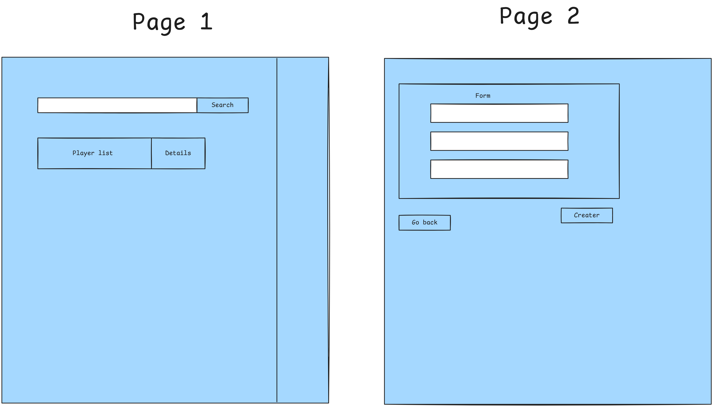
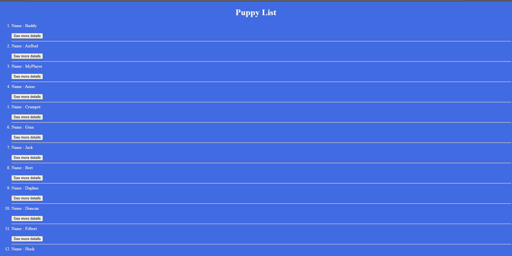
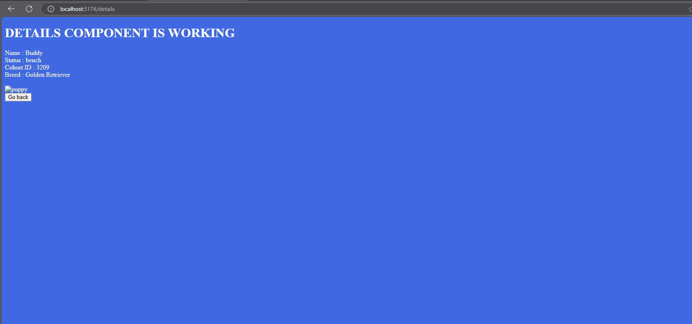
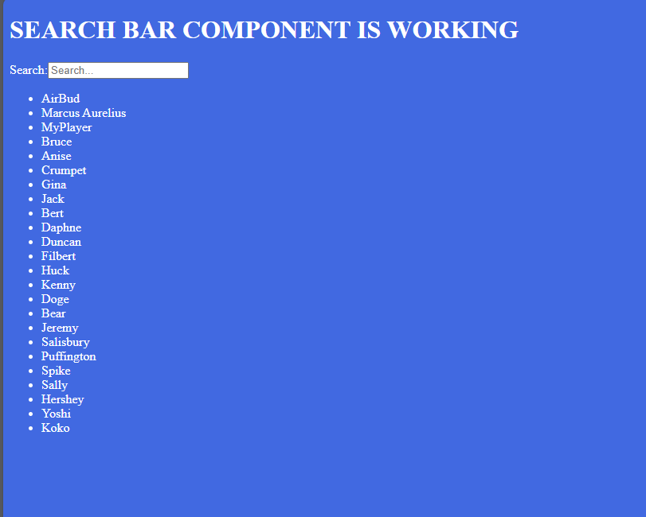

# React Puppy Bowl

Functional Requirements
Your site's users should be able to:

See a list of each player competing in the bowl.

Click a "See Details" button or something similar on each player that will lead you to another page view with specific details on that player, such as owner and team name.

Have a form to CREATE a new player.
Search for a specific player in a search bar and see a new list with only puppies with names that match the text in the search bar.

Create a button to DELETE a player (ONLY DELETE PLAYERS YOU YOURSELF CREATE, PLEASE!)

